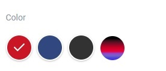
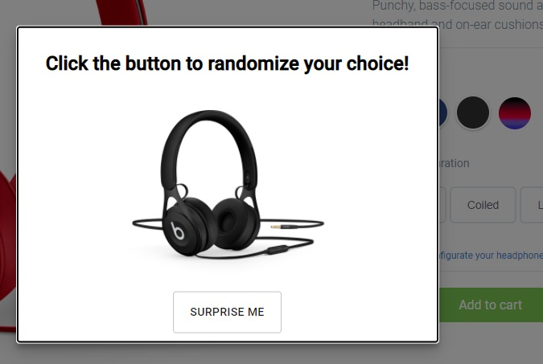
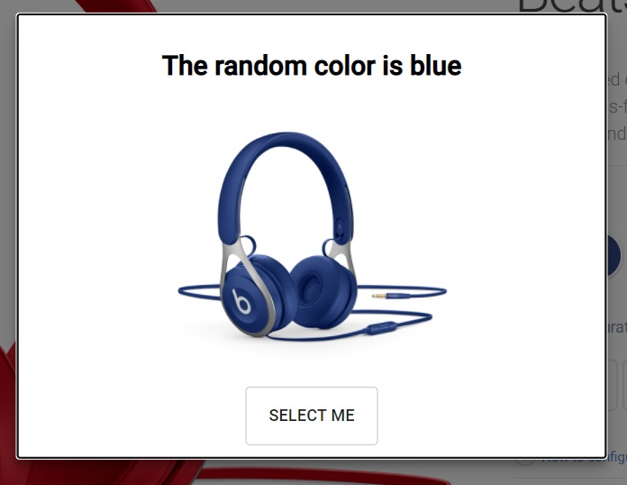

## Easysize Front end test task

Front-end task for Easysize company:

### Instructions

- Uncomment widget code in `script.js` from original project ;
- rum nvm use
- npm install/build/serve
- The library will be served at `http://172.0.0.1:3355/demo.js` as requested
- An widget button appears after a few seconds with the colors mixed

  

- When clicks the button a modal show up

  

- After click the button surprise me, the color was choose randomly to user select

  

